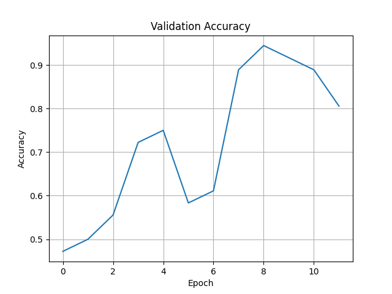
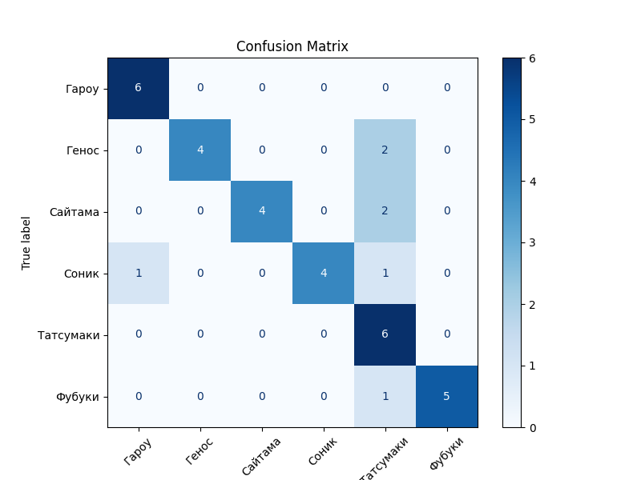

## 📁 Структура проекта (не помещается в гитхаб)

```

AugmentationHomework5/
├── data/
│   ├── train/       # исходные тренир. данные (по классам)
│   ├── val/         # валидация (80/20 split)
│   └── test/        # финальная проверка
├── datasets.py      # загрузчик CustomImageDataset
├── augmentations.py # std + кастомные аугментации
├── analysis.py      # анализ датасета → results/stats.json + plots/*.png
├── pipeline.py      # класс AugmentationPipeline + save\_samples
├── experiment.py    # замеры времени/памяти → results/experiment.csv + plots/experiment\_*.png
├── split_train_val.py   # делит train → train/ + val/
├── merge_val_to_train.py# обратно val → train
├── train.py         # обучение ResNet18 + логи + метрики + confusion matrix
├── plots/           # все графики
├── results/         # все JSON/CSV/модель/log.txt
├── requirements.txt
└── README.md

````

---

##  Установка

```bash
git clone <repo_url>
cd augmentation_project
pip install -r requirements.txt
````

---

##  Первичная подготовка

1. **Разделение**

   ```bash
   python split_train_val.py
   ```

   — создаст `data/val/` (по классам, 20% изображений).

2. **(Опционально) Сброс**

   ```bash
   python merge_val_to_train.py
   ```

   — перенесёт всё из `val/` обратно в `train/`.

---

##  Анализ датасета

```bash
python analysis.py
```

* Генерирует `results/stats.json` со статистикой:

  ```json
  {
    "by_class":   { "hero1": 120, "hero2": 95, … },
    "min":        [64, 64],
    "max":        [1024, 1024],
    "mean":       [256, 256],
    "total_images": 1200
  }
  ```
* Сохраняет в `plots/`:

  * `width_distribution.png`
  * `height_distribution.png`
  * `images_per_class.png`

---

##  Эксперименты с размерами и аугментациями

```bash
python experiment.py
```

* Проводит замеры **время** и **потребление памяти** при применении всех аугментаций к 100 изображениями:

  | size (px) | time\_s | peak\_mem\_mb | rss\_diff\_mb |
  | --------- | ------- | ------------- | ------------- |
  | 64        | 0.12    | 15.34         | 5.20          |
  | 128       | 0.24    | 28.76         | 9.81          |
  | 224       | 0.56    | 55.12         | 18.02         |
  | 512       | 1.80    | 150.45        | 42.30         |
* Сохраняет `results/experiment.csv`
* Графики в `plots/`:

  * `experiment_time.png`
  * `experiment_peak_mem.png`
  * `experiment_rss_diff.png`

---

##  Пайплайн аугментаций

```bash
python pipeline.py
```

* Использует `AugmentationPipeline` для трёх конфигураций: `light`, `medium`, `heavy`
* Сохраняет в `plots/{light,medium,heavy}_samples/` примеры:

  * оригинал
  * каждая аугментация отдельно
  * все вместе

---

## ️ Обучение модели

```bash
python train.py
```

* Датасеты: `data/train/` для обучения, `data/val/` для валидации
* Модель: `ResNet18` (предобученная ImageNet → fine‑tune)
* Оптимизация:

  * Adam (lr=1e-3)
  * ReduceLROnPlateau
  * EarlyStopping (patience=3)
* Аугментации: все из `augmentations.py`
* **Сохраняет**:

  * `results/best_model.pth`
  * `results/metrics.json`
  * `results/log.txt`
  * `plots/train_loss.png`
  * `plots/validation_loss.png`
  * `plots/validation_accuracy.png`
  * `plots/confusion_matrix.png`

---

## 📊 Основные результаты

**Лучшие метрики** (пример из `results/metrics.json`):

```json
{
  "best_val_accuracy": 0.92,
  "last_val_accuracy": 0.89,
  "train_loss": [1.23, ... , 0.45],
  "val_loss": [1.10, ... , 0.55],
  "val_acc":  [0.65, ... , 0.89]
}
```

<p align="center">
  
  
</p>

---


